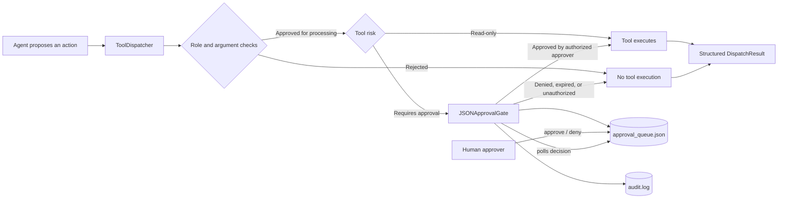
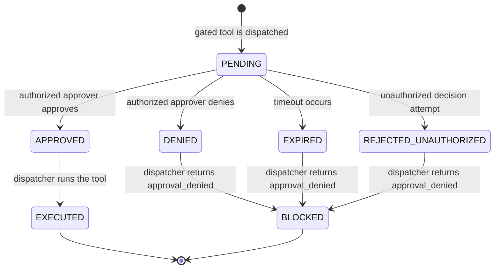

# Week 4 Explained: The Approval Gate

A plain-language, diagram-first walkthrough of Member 5's approval gate,
authorization checks, approval-gated test execution, draft creation, audit
logging, and verification evidence.

## The Idea in One Line

Some actions are too risky for an agent to perform automatically. The system
therefore records an approval request, waits for a human decision, and only
executes the action when the decision is approved.

## 1. The Big Picture



The agent and human approver are separate processes. They communicate through
the shared approval queue file and audit file.

The dispatcher remains the central execution boundary. The approval gate is
injected into the dispatcher through the `ApprovalGate` protocol.

## 2. What Happens to One Approval Request



Only the `APPROVED` path allows the high-impact tool to execute.

The gate itself returns an `ApprovalVerdict`. The dispatcher converts that
verdict into a structured `DispatchResult`.

## 3. Current Repository Files

| File                                                         | Responsibility                                                                           |
| ------------------------------------------------------------ | ---------------------------------------------------------------------------------------- |
| `src/orchestrator/approval_gate.py`                         | Persistent queue, approval decisions, timeout handling, authorization, and audit logging |
| `src/orchestrator/router.py`                       | Role checks, argument checks, approval integration, execution, and structured results    |
| `src/tools/approval_tools.py`                                | `RunTestsTool` and `DraftIssueTool` implementations                                      |
| `scripts/approve_cli.py`                                     | Human-facing approval and denial commands                                                |
| `scripts/member5_approval_demo.py`                           | Automated approval-gate demonstration                                                    |
| `tests/integration/test_approval_gate.py`                    | Approval, denial, timeout, authorization, audit, and draft tests                         |
| `tests/fixtures/member2/corpus/logs/test_run_2026_09_15.txt` | Sanitized synthetic RAG test fixture                                                     |
| `src/rag/retrieval.py`                                       | Directory-aware corpus type classification                                               |
| `src/ingestion/tag_provenance.py`                            | Corpus provenance generation and sanitized test-suite output                             |

The implementation does not use a folder named `approval_gate/`. The approval
gate is a module named `approval_gate.py`.

## 4. The Dispatcher Is the Main Safety Boundary

The relevant contract is defined in:

```text
src/orchestrator/router.py
```

The dispatcher processes a proposal in this order:

```text
1. Parse and normalize the proposed action
2. Reject unknown or non-tool actions
3. Resolve the tool from the fixed registry
4. Check the caller's role
5. Validate tool arguments
6. Request approval when the tool requires it
7. Execute the tool only after approval
8. Validate and size-limit the output
9. Return DispatchResult
```

The model cannot dynamically create tools or execute arbitrary functions. Tools
must first be registered in `ToolRegistry`.

The approval gate is called through this protocol:

```python
class ApprovalGate(Protocol):
    def check(
        self,
        *,
        action: Action,
        arguments: Mapping[str, Any],
        context: ExecutionContext,
    ) -> ApprovalVerdict:
        ...
```

## 5. `approval_gate.py`

The implementation is in:

```text
src/orchestrator/approval_gate.py
```

### `ApprovalRequest`

`ApprovalRequest` stores:

- request ID;
- action name;
- action payload;
- requesting actor;
- request timestamp;
- current status;
- deciding approver;
- decision timestamp;
- decision reason.

### `JSONApprovalStore`

`JSONApprovalStore` persists requests in:

```text
data/approval_queue.json
```

It supports:

- `create()`;
- `get()`;
- `update()`;
- `list_pending()`.

Atomic file replacement is used when writing the queue so a partially written
JSON file is less likely during concurrent access.

### `AuditLogger`

`AuditLogger` writes one JSON object per line to:

```text
data/audit.log
```

The audit file records events such as:

```text
approval_requested
decision_recorded
approval_expired
approval_rejected_unauthorized
action_blocked
action_executed_after_approval
```

Runtime queue and audit files are evidence artifacts only. They must not be
committed because the repository sensitive-data check blocks `.log` files and
runtime files may contain prompts or payloads.

### `JSONApprovalGate.check()`

`JSONApprovalGate.check()`:

1. Creates a pending request.
2. Stores it in the shared JSON queue.
3. Records an `approval_requested` audit event.
4. Polls until a decision or timeout.
5. Re-checks the deciding approver against the allow-list.
6. Returns `APPROVED` only for an authorized approval.
7. Returns `DENIED` for denial, timeout, or unauthorized decisions.

Timeout never auto-approves an action.

### `JSONApprovalGate.decide()`

`decide()` is used by the CLI or another human-facing process.

It:

- rejects unknown request IDs;
- rejects decisions on already-decided requests;
- rejects approvers outside the allow-list;
- records the decision and reason;
- writes a `decision_recorded` or `decision_rejected_unauthorized` event.

## 6. `approval_tools.py`

The implementation is in:

```text
src/tools/approval_tools.py
```

### `RunTestsTool`

`RunTestsTool` is declared as:

```python
name = "run_tests"
risk = ToolRisk.REQUIRES_APPROVAL
```

It accepts:

```python
{
    "test_node_ids": ["dispatcher_tests"],
    "session_id": "session-1"
}
```

The tool rejects missing or empty test node IDs, non-string IDs, missing
session IDs, and unknown test node IDs.

The actual commands come from a fixed manifest supplied when the tool is
constructed. The model cannot supply an arbitrary shell command or filesystem
path. Execution uses `shell=False`.

The result contains:

```python
{
    "status": "pass" | "fail" | "error",
    "per_test": [
        {
            "id": "...",
            "result": "pass" | "fail",
            "duration_ms": 0,
            "stdout": "...",
            "stderr": "..."
        }
    ]
}
```

### `DraftIssueTool`

`DraftIssueTool` is declared as:

```python
name = "draft_issue"
risk = ToolRisk.READ_ONLY
```

It accepts:

```python
{
    "title": "...",
    "body": "...",
    "evidence_refs": ["tests/example.py"]
}
```

It writes a local draft to:

```text
data/issue_drafts.json
```

The output is:

```python
{
    "draft_id": "...",
    "status": "draft"
}
```

It does not submit a GitHub issue or pull request. Human review remains
necessary before any external submission.

## 7. Human Approval CLI

The CLI is:

```text
scripts/approve_cli.py
```

Set the shared runtime directory and authorized approvers:

```bash
export QA_AGENT_DATA_DIR="$PWD/data/member5-demo"
export QA_AGENT_APPROVERS="Alice,Bob"
```

List pending requests:

```bash
PYTHONPATH=src python3 scripts/approve_cli.py list
```

Approve a real request:

```bash
PYTHONPATH=src python3 scripts/approve_cli.py approve \
  ACTUAL_REQUEST_ID \
  --by Alice \
  --reason "Approved after review."
```

Deny a real request:

```bash
PYTHONPATH=src python3 scripts/approve_cli.py deny \
  ACTUAL_REQUEST_ID \
  --by Alice \
  --reason "Not approved."
```

`ACTUAL_REQUEST_ID` must be copied from the output of the `list` command. It
is not a literal value.

## 8. Two-Terminal Manual Demonstration

The automated demo uses a temporary directory and approves its request
internally. It is not connected to the CLI's persistent directory.

For a genuine two-terminal demonstration, use the following in Terminal 1:

```bash
export QA_AGENT_DATA_DIR="$PWD/data/member5-demo"
export QA_AGENT_APPROVERS="Alice,Bob"

PYTHONPATH=src python3 -c '
from orchestrator.approval_gate import AuditLogger, JSONApprovalGate, JSONApprovalStore
from orchestrator.router import Action, ExecutionContext

gate = JSONApprovalGate(
    store=JSONApprovalStore("data/member5-demo/approval_queue.json"),
    audit=AuditLogger("data/member5-demo/audit.log"),
    authorized_approvers={"Alice", "Bob"},
    timeout_seconds=120,
    poll_interval_seconds=0.5,
)

result = gate.check(
    action=Action.RUN_TESTS,
    arguments={
        "test_node_ids": ["dispatcher_tests"],
        "session_id": "manual-session",
    },
    context=ExecutionContext(
        session_id="manual-session",
        actor_id="qa-agent",
        role="qa_engineer",
    ),
)

print(result)
'
```

This terminal waits for a decision.

In Terminal 2, from the repository root, run:

```bash
export QA_AGENT_DATA_DIR="$PWD/data/member5-demo"
export QA_AGENT_APPROVERS="Alice,Bob"

PYTHONPATH=src python3 scripts/approve_cli.py list
```

Copy the displayed request ID and approve it:

```bash
PYTHONPATH=src python3 scripts/approve_cli.py approve \
  ACTUAL_REQUEST_ID \
  --by Alice \
  --reason "Approved after review."
```

Terminal 1 should then return an approved verdict.

After the demonstration, remove the runtime evidence directory:

```bash
rm -rf data/member5-demo
```

Do not commit runtime files such as:

```text
data/member5-demo/approval_queue.json
data/member5-demo/audit.log
```

## 9. Automated Evidence

The integration tests are in:

```text
tests/integration/test_approval_gate.py
```

They cover pending approval, authorized approval, denial, timeout, unknown
test node IDs, unauthorized approvers, audit events, and local draft-only
issue creation.

Run them with:

```bash
PYTHONPATH=src python3 -m unittest \
  tests.integration.test_approval_gate -v
```

Run the dispatcher contract tests:

```bash
PYTHONPATH=src python3 -m unittest \
  tests.integration.test_tool_dispatcher -v
```

Run the automated demo:

```bash
PYTHONPATH=src python3 scripts/member5_approval_demo.py
```

Run the RAG evaluation:

```bash
PYTHONPATH=src python3 -m unittest \
  tests.test_rag_eval -v
```

Run the sensitive-data scan:

```bash
python3 scripts/check_sensitive.py --all
```

The sensitive-data scan must exit with code `0`.

## 10. Sanitized RAG Evidence

The original test-run fixture used a `.log` filename. The repository security
scanner blocks all committed `.log` files because logs may contain secrets,
prompts, credentials, or personal data.

The replacement fixture is:

```text
tests/fixtures/member2/corpus/logs/test_run_2026_09_15.txt
```

It contains synthetic test-run data only.

The loader classifies files under a `logs/` corpus directory as
`DocumentType.LOG`, even when the safe materialized filename uses `.txt`.

The provenance generator writes:

```text
knowledge/corpus/logs/offline-test-suite.txt
```

instead of a blocked `.log` file.

This preserves the RAG evaluation while respecting the Week 3
sensitive-data-control requirement.

## 11. Likely Viva Questions

### Why use a shared file?

The agent and human approver are separate processes. A shared queue represents
the persistent coordination boundary that could later be implemented with a
database or approval service.

### Why check authorization in both places?

`decide()` checks the approver before recording a decision. `check()` checks the
stored decision again before returning approval. This is defense in depth
against a manually edited or incorrectly written queue entry.

### What happens if two people decide the same request?

The first decision changes the request from `PENDING`. A second decision raises
an error because the request is no longer pending.

### What happens on timeout?

The request is marked expired and the gate returns a denied verdict. Timeout
never results in automatic approval.

### Why keep an audit file?

The queue shows the current state of each request. The audit file preserves the
sequence of requests and decisions, which supports later observability and
review.

### Does `draft_issue` require approval?

The current implementation only creates a local draft and does not submit an
external issue. External issue or pull-request submission remains outside the
tool and must require a separate explicit human approval step.

### Does the gate itself execute tools?

No. The dispatcher calls the gate, receives a verdict, and only then invokes
the registered tool.

## 12. Final Safety Property

The important guarantee is:

```text
No approval -> no high-impact tool execution
```

More precisely:

```text
ToolDispatcher
  -> role authorization
  -> argument validation
  -> approval gate
  -> approved verdict
  -> tool execution
  -> output validation
```

If any required check fails, the tool does not execute and the dispatcher
returns a structured failure result.
