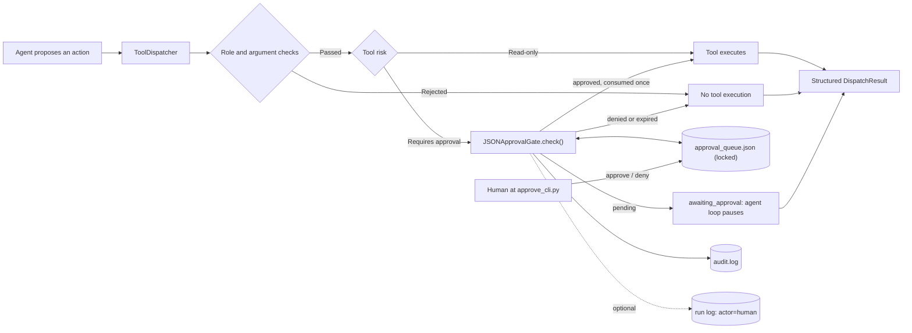
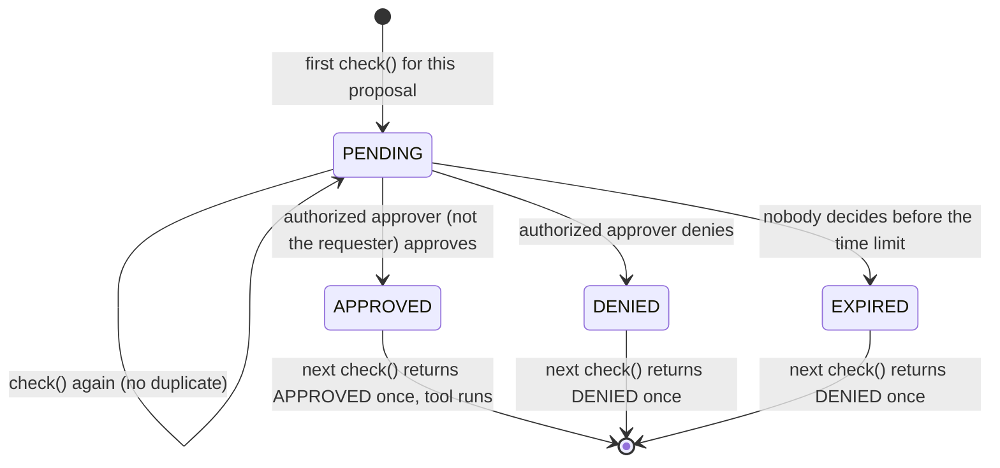

# Week 4 Explained: The Approval Gate

A plain-language, diagram-first walkthrough of Member 5's approval gate,
authorization checks, audit logging, and verification evidence. Updated on
2 October 2026 for the improved gate (non-blocking decisions, single-use
approvals, cross-process locking) and the switch to Member 3's tools.

## The Idea in One Line

Some actions are too risky for an agent to perform automatically. The system
records an approval request, a named human decides, and the action runs only
after an approval, and only once per approval.

## 1. The Big Picture


```mermaid
flowchart LR
    A["Agent proposes an action"] --> B["ToolDispatcher"]
    B --> C{"Role and argument checks"}
    C -->|"Rejected"| X["No tool execution"]
    C -->|"Passed"| D{"Tool risk"}
    D -->|"Read-only"| E["Tool executes"]
    D -->|"Requires approval"| F["JSONApprovalGate.check()"]
    F <--> G[("approval_queue.json (locked)")]
    H["Human at approve_cli.py"] -->|"approve / deny"| G
    F -->|"approved, consumed once"| E
    F -->|"pending"| P["awaiting_approval: agent loop pauses"]
    F -->|"denied or expired"| X
    F --> I[("audit.log")]
    F -.->|"optional"| R[("run log: actor=human")]
    E --> J["Structured DispatchResult"]
    X --> J
    P --> J
```

The agent and the human approver are separate processes. They share the
approval queue file, which is locked for every change so neither can
overwrite the other.

The dispatcher (`src/orchestrator/router.py`, Member 2) is the execution
boundary. The gate is injected into it through the `ApprovalGate` protocol.

## 2. What Happens to One Approval Request


```mermaid
stateDiagram-v2
    [*] --> PENDING: first check() for this proposal
    PENDING --> PENDING: check() again (no duplicate)
    PENDING --> APPROVED: authorized approver (not the requester) approves
    PENDING --> DENIED: authorized approver denies
    PENDING --> EXPIRED: nobody decides before the time limit
    APPROVED --> [*]: next check() returns APPROVED once, tool runs
    DENIED --> [*]: next check() returns DENIED once
    EXPIRED --> [*]: next check() returns DENIED once
```

- Requests are matched by a **fingerprint**: a SHA-256 of the session ID,
  the action, and the validated arguments. Re-proposing the same request
  finds the same entry.
- Every decision is **delivered once** (`consumed_at` is set). After that, an
  identical proposal starts a fresh request, so one approval can never run a
  tool twice.
- An unauthorized or self-approval attempt is refused and audited, but the
  request **stays pending** for a real approver.

## 3. Current Repository Files

| File                                      | Responsibility                                                              |
| ----------------------------------------- | --------------------------------------------------------------------------- |
| `src/orchestrator/approval_gate.py`       | Queue, locking, fingerprints, decisions, expiry, audit log, trace entries  |
| `src/orchestrator/router.py`              | Member 2's dispatcher: role and argument checks, calls the gate, runs tools |
| `src/tools/run_tests.py`                  | Member 3's approval-required `run_tests` tool                               |
| `src/tools/draft_issue.py`                | Member 3's approval-required `draft_issue` tool (local draft only)          |
| `src/sandbox/executor.py`                 | Runs one pytest node with a stripped environment and a timeout              |
| `scripts/approve_cli.py`                  | Human-facing `list`, `approve`, `deny` commands                             |
| `scripts/member5_approval_demo.py`        | Automated demonstration                                                     |
| `tests/integration/test_approval_gate.py` | 18 tests: blocking mode, non-blocking mode, safety cases                    |

> **Why there is no `approval_tools.py` any more.** Week 4 also shipped a
> stand-in `RunTestsTool` and `DraftIssueTool` in `src/tools/approval_tools.py`,
> written before Member 3's tools were merged. It duplicated Member 3's work
> and ran tests without stripping environment variables, so it was removed.

## 4. The Dispatcher Is the Main Safety Boundary

The dispatcher processes a proposal in this order:

```text
1. Parse and normalize the proposed action
2. Reject unknown or non-tool actions
3. Resolve the tool from the fixed registry
4. Check the caller's role
5. Validate tool arguments
6. Ask the approval gate when the tool requires it
7. Execute the tool only after an APPROVED verdict
8. Validate and size-limit the output
9. Return DispatchResult
```

The gate is called through this protocol:

```python
class ApprovalGate(Protocol):
    def check(
        self,
        *,
        action: Action,
        arguments: Mapping[str, Any],
        context: ExecutionContext,
    ) -> ApprovalVerdict:
        ...
```

The verdict is `APPROVED`, `DENIED` or `PENDING`. The dispatcher turns
`PENDING` into `awaiting_approval`, which makes Member 2's agent loop pause.

## 5. `approval_gate.py`

### `ApprovalRequest`

Stores the request ID, action, payload (the validated arguments), requester,
session, fingerprint, request time, expiry time, status, approver, decision
time, reason, and `consumed_at`.

### `JSONApprovalStore`

Persists requests in `data/approval_queue.json`.

- Every read-modify-write goes through `mutate()`, which holds an exclusive
  lock on `approval_queue.json.lock` (`fcntl` on macOS/Linux, `msvcrt` on
  Windows) and writes the file atomically.
- A corrupt or malformed file raises `ApprovalStoreError`. The dispatcher
  reports that as `approval_unavailable`, so nothing runs.
- `list_pending()` returns only requests that can still be decided.

### `AuditLogger`

Writes one JSON object per line to `data/audit.log`:

```text
approval_requested
decision_recorded
decision_rejected_unauthorized
decision_rejected_self_approval
approval_expired
approval_consumed
approval_rejected_unauthorized
action_blocked
```

The queue and the audit file are runtime files. They are ignored by Git, and
the sensitive-data check blocks `.log` files, because they hold payloads.

### `JSONApprovalGate.check()`

1. Fingerprints the request.
2. Under the lock, expires any pending request past its time limit.
3. If a decided, undelivered request matches, it delivers it once:
   - `APPROVED`, but only if the approver is in this gate's allow-list
     (a hand-edited queue is denied);
   - `DENIED` for a denial or an expiry.
4. If a pending request matches, it returns `PENDING`.
5. Otherwise it creates a pending request and returns `PENDING`.

With `wait_seconds > 0`, `check()` keeps asking until a decision arrives or
the wait runs out, and then expires the request. The default `0` returns at
once so the agent loop can pause and resume.

When a `trace_sink` (such as the Week 5 `RunLogger`) is supplied, the
delivered decision is also recorded as an `approval_granted` or
`approval_denied` trace entry with `actor=human`.

### `JSONApprovalGate.decide()`

Used by the CLI. It refuses:

- unknown request IDs;
- requests already decided or expired;
- approvers outside the allow-list (`UnauthorizedApprover`);
- the requester approving their own request (`SelfApprovalError`).

Otherwise it records the decision, approver, time and reason.

## 6. Human Approval CLI

```bash
export QA_AGENT_DATA_DIR="$PWD/data/member5-demo"
export QA_AGENT_APPROVERS="Alice,Bob"     # required; there is no default

PYTHONPATH=src python3 scripts/approve_cli.py list
PYTHONPATH=src python3 scripts/approve_cli.py approve ACTUAL_REQUEST_ID --by Alice --reason "Approved after review."
PYTHONPATH=src python3 scripts/approve_cli.py deny ACTUAL_REQUEST_ID --by Alice --reason "Not approved."
```

`list` shows each request's action, session, requester, age, fingerprint and
payload. `ACTUAL_REQUEST_ID` is copied from that output.

## 7. Two-Terminal Manual Demonstration

Terminal 1 asks for approval, waiting up to two minutes:

```bash
export QA_AGENT_DATA_DIR="$PWD/data/member5-demo"

PYTHONPATH=src python3 -c '
from orchestrator.approval_gate import AuditLogger, JSONApprovalGate, JSONApprovalStore
from orchestrator.router import Action, ExecutionContext

gate = JSONApprovalGate(
    store=JSONApprovalStore("data/member5-demo/approval_queue.json"),
    audit=AuditLogger("data/member5-demo/audit.log"),
    authorized_approvers={"Alice", "Bob"},
    wait_seconds=120,
)
print(gate.check(
    action=Action.RUN_TESTS,
    arguments={
        "test_node_ids": ["tests/fixtures/sandbox/sample_cases.py::test_addition_passes"],
        "session_id": "manual-session",
    },
    context=ExecutionContext(session_id="manual-session", actor_id="qa-agent", role="developer"),
))
'
```

Terminal 2 lists the request and approves it:

```bash
export QA_AGENT_DATA_DIR="$PWD/data/member5-demo"
export QA_AGENT_APPROVERS="Alice,Bob"
PYTHONPATH=src python3 scripts/approve_cli.py list
PYTHONPATH=src python3 scripts/approve_cli.py approve ACTUAL_REQUEST_ID --by Alice --reason "Approved after review."
```

Terminal 1 then prints an approved verdict. Remove the runtime folder
afterwards with `rm -rf data/member5-demo`.

## 8. Automated Evidence

```bash
PYTHONPATH=src python3 -m unittest tests.integration.test_approval_gate -v
PYTHONPATH=src python3 -m unittest tests.integration.test_router -v
PYTHONPATH=src python3 scripts/member5_approval_demo.py
python3 scripts/check_sensitive.py --all
```

The 18 gate tests cover:

- **Blocking mode:** pending does not run, approval runs, timeout denies and
  expires, unknown test IDs are rejected before approval, an unauthorized
  attempt does not cancel the request, audit events, and `draft_issue` needing
  approval.
- **Non-blocking mode:** first check is pending, no duplicates, run exactly
  once with no replay, denial delivered once, self-approval rejected, expiry,
  corrupt queue fails closed, hand-edited approval denied, concurrent
  decisions from two processes cannot both win, human decisions reach the
  trace sink, and a trace failure fails closed without losing the approval.

The end-to-end pause, approve and resume path with the real agent loop is
covered in `tests/integration/test_run_logger_agent_loop.py`.

## 9. Sanitized RAG Evidence

The original test-run fixture used a `.log` filename, which the sensitive-data
check blocks. The replacement is the synthetic
`tests/fixtures/member2/corpus/logs/test_run_2026_09_15.txt`, and the loader
classifies anything under `logs/` as `DocumentType.LOG`. The provenance
generator writes `knowledge/corpus/logs/offline-test-suite.txt` instead of a
`.log`. See `docs/requirements/week3/sensitive-data-check.md` for why the
re-added `.log` and its exemption were removed on 2 October 2026.

## 10. Likely Viva Questions

### Why use a shared file?

The agent and the human approver are separate processes. A locked queue file
is the simplest persistent coordination point, and could later be replaced by
a database or approval service behind the same `ApprovalGate` protocol.

### Why not just wait inside `check()`?

Waiting freezes the whole agent. Returning `PENDING` lets Member 2's loop
pause cleanly and resume after the human decides; `wait_seconds` is still
available for demos.

### What stops one approval being used twice?

Each decision is delivered once and marked `consumed_at`. A second identical
proposal creates a new request that needs a new approval.

### Why check authorization in both places?

`decide()` checks the approver before recording a decision. `check()` checks
it again before returning `APPROVED`, so a hand-edited queue entry, or a CLI
started with a different approver list, cannot approve anything.

### Can the agent approve its own request?

No. `decide()` rejects a decision whose approver is the requester.

### What happens if two people decide at the same moment?

Both decisions go through the file lock. The first changes the request from
pending; the second is refused because it is no longer pending. A test runs
ten simultaneous decisions from two store instances and checks exactly one
succeeds.

### What happens on timeout?

The request is marked expired and delivered as `DENIED`. Timeout never
approves anything.

### Does `draft_issue` require approval?

Yes. Member 3's `draft_issue` is `REQUIRES_APPROVAL`, and it only stores a
local draft. Submitting an issue or pull request is outside the system.

### Does the gate itself execute tools?

No. The dispatcher asks the gate, receives a verdict, and only then calls the
registered tool.

## 11. Final Safety Property

```text
No approval -> no high-impact tool execution
One approval -> at most one execution
```

```text
ToolDispatcher
  -> role authorization
  -> argument validation
  -> approval gate (fingerprint, lock, single use)
  -> approved verdict
  -> tool execution
  -> output validation
```

If any required check fails, the tool does not execute and the dispatcher
returns a structured failure result.
